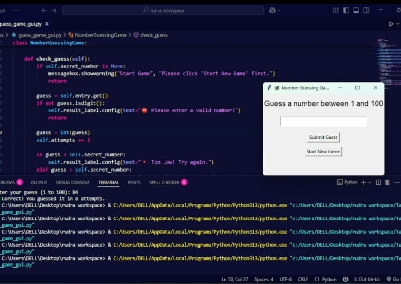

# PRODIGY_SD_02
# 🎯 Number Guessing Game (Python + Tkinter)

An interactive and fun **Number Guessing Game** built using **Python** and **Tkinter**. The game selects a secret number between 1 and 100, and your goal is to guess it in as few attempts as possible. The app gives helpful feedback after each guess and tracks your attempts.



## 🕹️ How to Play

1. Click **Start New Game**.
2. Enter a number between **1 and 100**.
3. Click **Submit Guess**.
4. The app will give feedback:
   - 🔻 Too low
   - 🔺 Too high
   - ✅ Correct guess!
5. When you guess correctly, it shows the number of attempts used.

## ✨ Features

- Random number generated between 1 and 100
- Tracks number of attempts
- User-friendly GUI built with Tkinter
- Validation for non-numeric input
- Instant feedback on each guess
- 🎉 Celebration message when you win!

## 📁 Files

- `guess_game_gui.py` – Main Python file containing the game logic and GUI.
- `game_interface.jpg` – Screenshot of the game UI.
- `game_result.jpg` – Screenshot showing game win scenario.

## 🖥️ Technologies Used

- Python 3.x
- Tkinter (built-in GUI library)
- Random module

## 🚀 Getting Started

1. Clone the repository:
   ```bash
   git clone https://github.com/yourusername/number-guessing-game-gui.git
   cd number-guessing-game-gui
